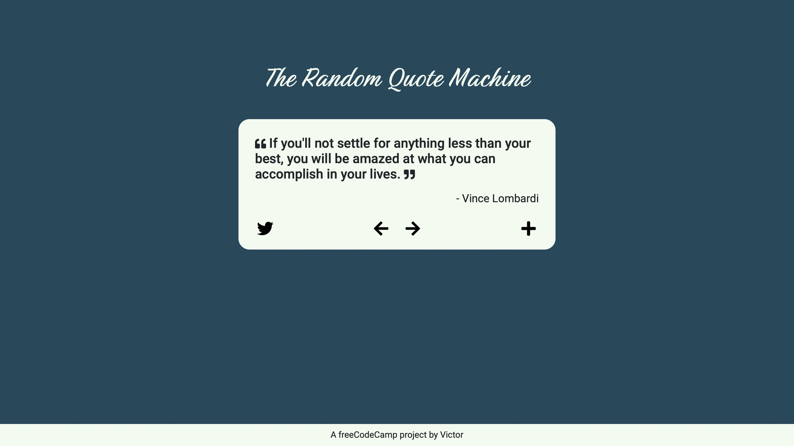

# Random Quote Machine
https://victordrumond.github.io/random-quote-machine/

## Technologies
`HTML` `CSS` `JavaScript` `Bootstrap` `jQuery`

## Description
* A responsive page that loads quotes randomly from an API.
* Built with HTML, CSS (with Bootstrap) and JavaScript (with jQuery).
* A [project](https://www.freecodecamp.org/learn/front-end-development-libraries/front-end-development-libraries-projects/build-a-random-quote-machine) from freeCodeCamp's Front End Development Libraries Certification.
* Extra feature: navigation buttons allow user to go back and forth through loaded quotes.
* Icons from [Font Awesome](https://fontawesome.com).

## Credits
* API endpoint provided by [Sergey Sokurenko](https://github.com/ssokurenko).

## Screenshot
